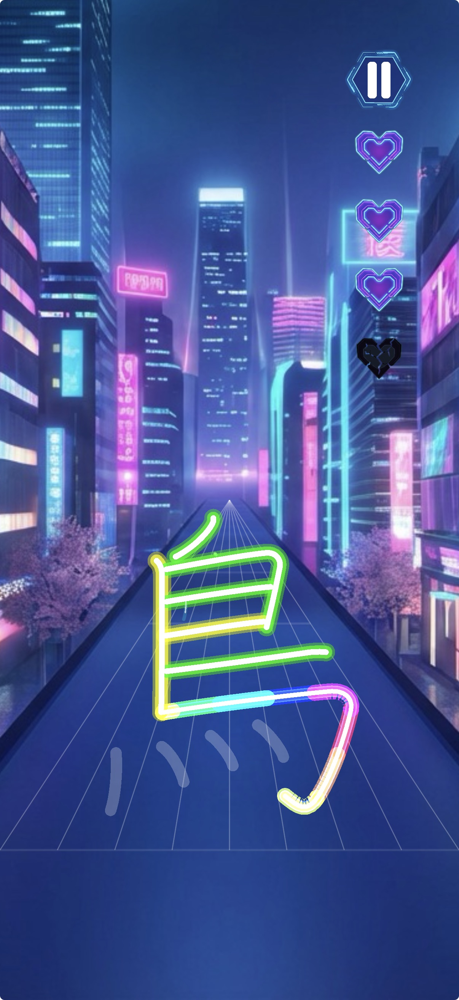

  

# Beat Kanji

Beat Kanji let's you practice Japanese kanji to the beat - simply pick a song and start swiping strokes!

Available on the App Store (SOON) for iPhone and iPad.

## Features

- over 2000 kanji, ranging from N5-N1
- hiragana and katakana
- feedback on each stroke
- many fun songs
- apple pencil support on iPad

and, most importantly: **NO ads!**

## Screenshots

  
  
  
  

## Technical Details

For setup instructions, project structure, and credits, please see [Technical Details](doc/technical_details.md).

## License

- **Source Code**: [MIT License](LICENSE).
- **Assets**: Proprietary and Third-Party licenses. See [LICENSE-ASSETS.md](LICENSE-ASSETS.md).
